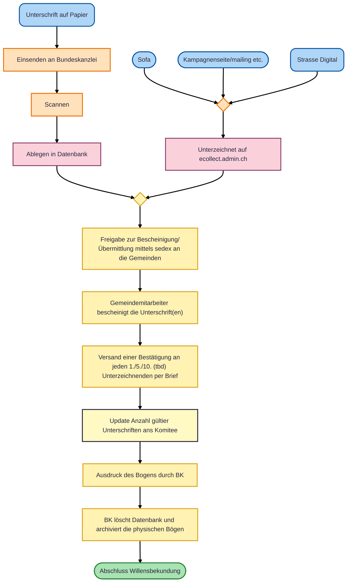
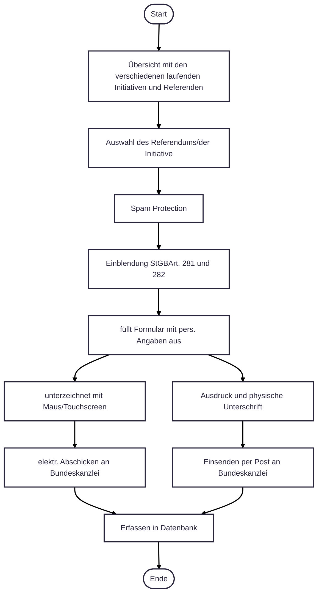

# 5) E-Collecting mittels einfacher digitaler Signatur

## Approach

Gegenüber einer digitalen Identität gibt es grosses Misstrauen in der Bevölkerung. Der Vorschlag soll untersuchen, ob es Ansätze gibt, ein E-Collecting mittels einer einfachen elektronischer Signatur zu betreiben. Darunter wird eine Unterschrift verstanden, welche mittels Maus oder Touchscreen erstellt wird. Dabei soll der Ablauf möglichst nahe am Papierprozess angesiedelt sein. Die Unterzeichnung soll weiterhin niederschwellig sein, dadurch wird ein Missbrauch möglich. Um diesen möglichst tief zu halten, wird der Bürger auf dem Postweg über seine Willensbekundung informiert.

## Description

Auf der Website der Bundeskanzlei (BK) kann ein Bürger einen Unterschriftenbogen herunterladen oder online ausfüllen und mittels einfacher Signatur seine Willensbekundung abgeben. Es ist zu überlegen, ob der «Browser-Fingerprint» (beispielsweise welches Betriebssystem verwendet wird) gespeichert werden soll und zur Erkennung von Missbrauch eingesetzt werden soll. Dadurch werden jedoch Daten des Bürger gespeichert, die nicht zwingend notwendig sind.
Druckt der Bürger den Unterschriftenbogen aus, kann er diesen direkt der BK senden. Diese scannt den Bogen ein. Dieser Bogen ist durch die BK vorgegeben und enthält nur eine Unterschrift.
Die BK sendet jedem Unterzeichner auf dem Postweg eine Bestätigung. Der Bürger hat nun die Möglichkeit, allfällige Missbräuche zu melden. In diesem Bestätigungsbrief hat eine Sammelgruppe auch die Möglichkeit nochmals auf ihr Anliegen aufmerksam zu machen und beispielsweise für Spenden oder einer Parteimitgliedschaft zu werben. Die Sammelgruppe hat aber keine Kenntnis wer unterschrieben hat. Einzig Anzahl Unterschriften pro Tag und allenfalls Kanton oder Gemeinde ist ihr bekannt.
Die digital und analog eingereichten Unterschriften werden nun zusammengeführt und den Gemeinden mittels Web-Plattform oder Schnittstelle zur Beglaubigung zur Verfügung gestellt. Dieser Prozess zwischen den Gemeinden und BK läuft digital ab. Nach der Beglaubigung durch die Gemeinde wird der Unterschriftenbogen durch die BK ausgedruckt und zusammen mit den herkömmlich eingereichten Unterschriftenbögen «zwischengelagert» bis zum Ende der Sammelfrist. Die Eintrag zur Unterschrift wird in der Datenbank der BK gelöscht. Die Gemeinden sind, wie bisher, dafür verantwortlich allfällig doppelte Unterschriften zu erkennen.

### Strengths:
Der Papier-/ und elektronische Prozess werden möglichst rasch zusammengeführt. Das Unterschreiben ist mittels Browser möglich und benötigt keine zusätzlichen Applikationen. Die AHV-Nummer wird für die Beglaubigung nicht benötigt. Und der Prozess ist für jeden Bürger nachvollziehbar und einfach zu verstehen.

### Weaknesses:
Unterschriften können digital einfach abgegeben werden, dies ist aber auch auf dem Papierweg möglich. Dies kann zu Missbrauch führen. Durch die Angabe des Geburtsdatum ist eine grossflächige Manipulation aber nur möglich, wenn man sich illegal entsprechende Daten beschafft hat. Es entstehen jährliche Kosten für den Briefversand für die Bestätigung der Unterzeichnung.

## Ablauf

## User Journey "Digitale Unterzeichnung"

## Sicherheitsmerkmal: Bestätigung der Willensbekundung an den Unterzeichner

Statt auf eine digitale Identität, setzt der Lösungsvorschlag auf einen Rückkanal zum Unterzeichner. Auf dem Postweg wird dem Unterzeichner eine Bestätigung seiner Willensbekundung gesendet. Mit der Aufforderung, falls er dies nicht unterzeichnet hat, dies der Gemeinde zu melden.

Aus Kostengründen könnte auch nur einer Stichprobe aus den total eingesendeten die Bestätigung geschickt werden. Wird eine Unterschriftensammlung im grossen Ausmass manipuliert, wird dies auch bei einer Stichprobe auffallen.

## Demo

[Dokumentation](demo/README.md)

[Live Demo](https://ecollectdemo.vercel.app/)

## Topics addressed

| Topic | (How) is it addressed? |
| - | ------- |
| 1 | Erstellung eines Mockup der E-Collecting Plattform |
| 2 | Sammelgruppen haben Zugriff Statistik der eingereichten Unterschriften |
| 3 | Sammelgruppen melden sich beim Initiativkomitee bzw. BK bei einem Referendum, jede Sammelgruppe erhält eine Landingpage |
| 4 | Jede Sammelgruppen erhält auf ihrer Landingpage Platz für ihr Argumentarium |
| 5 | Digitale Bescheinigung der Unerschriften |
| 6 | offen |
| 7 | Beibehaltung des Status Quo |
| 8 | Papier- und Digitalprozess werden vor der Beglaubigung zusammengeführt |
| 9 | Beglaubigungsprozess mittels Web Plattform oder Schnittstelle |
| 10 | offen |

## Team Members

- [Urs Lang] (https://github.com/urs-lang)
- [Pascal Fouquet]
- [Oleg Lavrovsky]
- [Rachel]
- [Melanie Hartmann]

